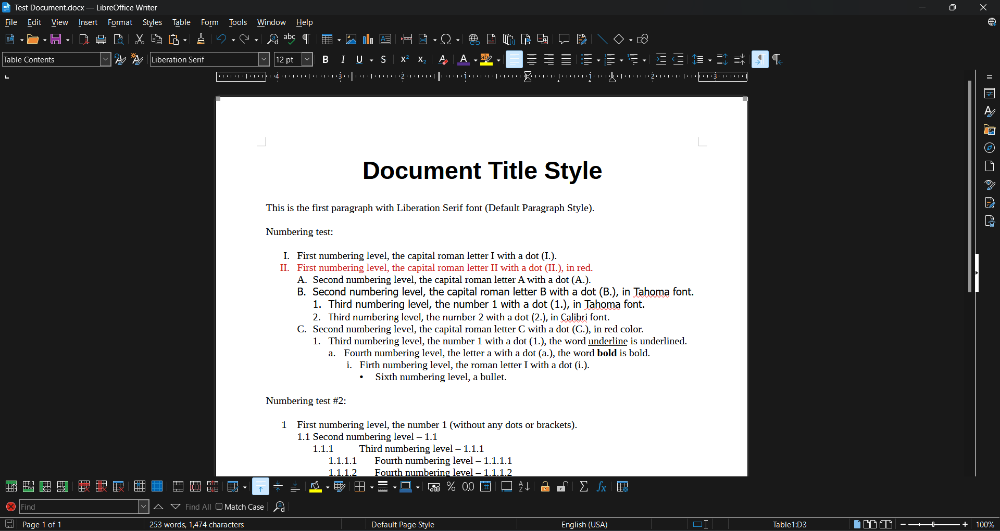
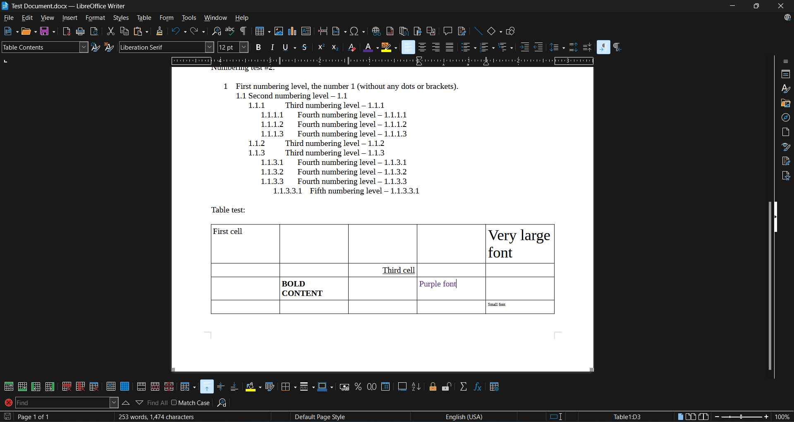
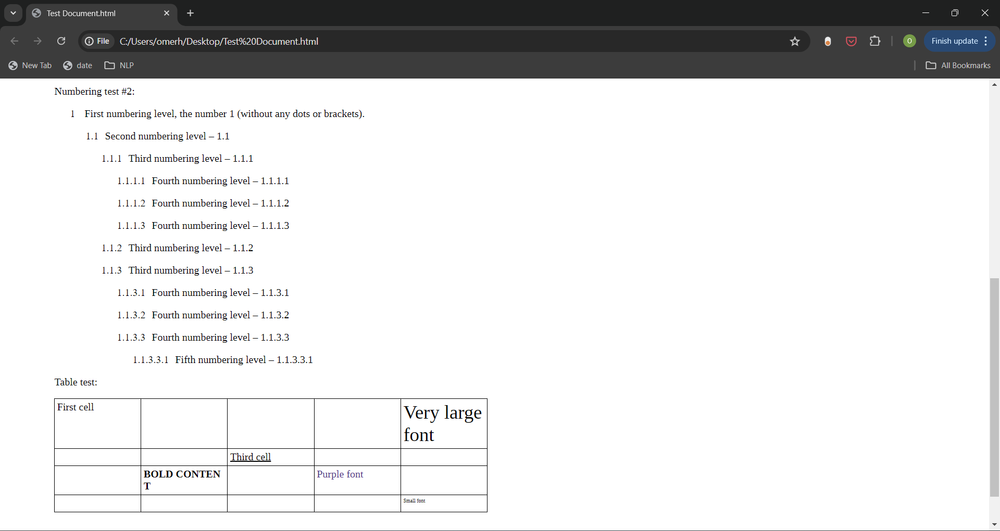

# Docx Parser and Converter 📄✨

A powerful library for converting DOCX documents into HTML and plain text, with detailed parsing of document properties and styles.

## Table of Contents
- [Introduction 🌟](#introduction-)
- [Project Overview 🛠️](#project-overview-)
- [Key Features 🌟](#key-features-)
- [Installation 💾](#installation-)
- [Usage 🚀](#usage-)
- [Quick Start Guide 📖](#quick-start-guide-)
- [Supported XML Parsing Types 📄](#supported-xml-parsing-types-)
- [General Code Flow 🔄](#general-code-flow-)
- [Conversion Table of DOCX XML Elements to HTML](#conversion-table-of-docx-xml-elements-to-html)
- [Examples 📚](#examples-)
- [API Reference 📜](#api-reference-)

## Introduction 🌟
Welcome to the Docx Parser and Converter project! This library allows you to easily convert DOCX documents into HTML and plain text formats, extracting detailed properties and styles using Pydantic models.

## Project Overview 🛠️
The project is structured to parse DOCX files, convert their content into structured data using Pydantic models, and provide conversion utilities to transform this data into HTML or plain text.

## Key Features 🌟
- Convert DOCX documents to HTML or plain text.
- Parse and extract detailed document properties and styles.
- Structured data representation using Pydantic models.

## Installation 💾
To install the library, you can use pip. (Add the pip install command manually)

```sh
pip install docx-parser-converter
```

## Usage 🚀

### Importing the Library
To start using the library, import the necessary modules:

```python
from docx_parser_converter.docx_to_html import DocxToHtmlConverter
from docx_parser_converter.docx_to_txt import DocxToTxtConverter
from docx_parser_converter.docx_parsers.utils import read_binary_from_file_path
```

### Quick Start Guide 📖
1. **Convert to HTML**:
   ```python
   from docx_parser_converter.docx_to_html.docx_to_html_converter import DocxToHtmlConverter
   from docx_parser_converter.docx_parsers.utils import read_binary_from_file_path

   docx_path = "path_to_your_docx_file.docx"
   html_output_path = "output.html"

   docx_file_content = read_binary_from_file_path(docx_path)

   converter = DocxToHtmlConverter(docx_file_content, use_default_values=True)
   html_output = converter.convert_to_html()
   converter.save_html_to_file(html_output, html_output_path)
   ```

2. **Convert to Plain Text**:
   ```python
   from docx_parser_converter.docx_to_txt.docx_to_txt_converter import DocxToTxtConverter
   from docx_parser_converter.docx_parsers.utils import read_binary_from_file_path

   docx_path = "path_to_your_docx_file.docx"
   txt_output_path = "output.txt"

   docx_file_content = read_binary_from_file_path(docx_path)

   converter = DocxToTxtConverter(docx_file_content, use_default_values=True)
   txt_output = converter.convert_to_txt(indent=True)
   converter.save_txt_to_file(txt_output, txt_output_path)
   ```

## Supported XML Parsing Types 📄

The Docx Parser and Converter library supports parsing various XML components within a DOCX file. Below is a detailed list of the supported and unsupported components:

### Supported Components

1. **document.xml**:
   - **Document Parsing**: Parses the main document structure.
   - **Paragraphs**: Extracts paragraphs and their properties.
   - **Runs**: Extracts individual text runs within paragraphs.
   - **Tables**: Parses table structures and properties.
   - **Table Rows**: Extracts rows within tables.
   - **Table Cells**: Extracts cells within rows.
   - **List Items**: Handles both bulleted and numbered lists through paragraph properties.

2. **numbering.xml**:
   - **Numbering Definitions**: Parses numbering definitions and properties for lists.
   - **Numbering Levels**: Extracts different levels of numbering for nested lists.

3. **styles.xml**:
   - **Paragraph Styles**: Extracts styles applied to paragraphs.
   - **Run Styles**: Extracts styles applied to text runs.
   - **Table Styles**: Parses styles applied to tables and table elements.
   - **Default Styles**: Extracts default document styles for paragraphs, runs, and tables.

### Unsupported Components

- **Images**: Parsing and extraction of images embedded within the document.
- **Headers and Footers**: Parsing of headers and footers content.
- **Footnotes and Endnotes**: Handling footnotes and endnotes within the document.
- **Comments**: Extraction and handling of comments.
- **Custom XML Parts**: Any custom XML parts beyond the standard DOCX schema.

## General Code Flow 🔄

The Docx Parser and Converter library follows a structured workflow to parse, convert, and merge document properties and styles according to DOCX specifications. Here’s a detailed overview of the technical process:

1. **Parsing XML Files**:
   - **Document XML Parsing**: The `DocumentParser` class reads and parses the `document.xml` file to extract the document structure, including paragraphs, tables, and runs. This data is converted into `DocumentSchema` Pydantic models.
   - **Numbering XML Parsing**: The `NumberingParser` class parses the `numbering.xml` file to extract numbering definitions and levels, converting them into `NumberingSchema` Pydantic models.
   - **Styles XML Parsing**: The `StylesParser` class parses the `styles.xml` file to extract styles for paragraphs, runs, and tables, converting them into `StylesSchema` Pydantic models.

2. **Property and Style Merging**:
   - **Hierarchical Style Application**: The library applies styles to paragraphs and runs based on a defined hierarchy. Explicit properties in the `DocumentSchema` remain unchanged, while styles are applied based on the `style_id` if present.
   - **Default Style Application**: If no specific `style_id` is present, default styles from `StyleDefaults` are applied. Finally, any remaining null properties are filled with `default_rpr` and `default_ppr` from the `StylesSchema`.
   - **Efficient Property Merging**: The `merge_properties` function is used to efficiently merge properties by converting Pydantic models to dictionaries, adding only non-null properties, and reassigning them to the original models.

3. **Conversion to HTML and TXT**:
   - **DOCX to HTML**:
     - The `DocxToHtmlConverter` class takes the parsed `DocumentSchema` and converts the document elements into HTML format.
     - Styles and properties are translated into equivalent HTML tags and CSS attributes.
     - The converted HTML content can be saved to a file using the `save_html_to_file` method.
     - **WYSIWYG Support**: The conversion maintains the visual representation of the document, ensuring accurate rendering of numbering, margins, and indentations as they appear in the original DOCX file.
   - **DOCX to TXT**:
     - The `DocxToTxtConverter` class converts the `DocumentSchema` into plain text format.
     - Paragraphs, lists, and tables are transformed into a readable plain text representation.
     - The converted text content can be saved to a file using the `save_txt_to_file` method.
     - **WYSIWYG Support**: The conversion preserves the structure of the document, maintaining numbering, margins, and indentations to ensure the text layout resembles the original document's format.

This detailed process ensures that the Docx Parser and Converter library accurately parses and converts DOCX documents while preserving the original document's structure and style as much as possible.

## Conversion Table of DOCX XML Elements to HTML


| XML Element    | HTML Element                        | Notes                                                                 |
|----------------|--------------------------------------|-----------------------------------------------------------------------|
| w:p            | p                                    | Paragraph element                                                     |
| w:r            | span                                 | Run element, used for inline text formatting                          |
| w:tbl          | table                                | Table element                                                         |
| w:tr           | tr                                   | Table row                                                             |
| w:tc           | td                                   | Table cell                                                            |
| w:tblGrid      | colgroup                             | Table grid, converted to colgroup for column definitions              |
| w:gridCol      | col                                  | Grid column, converted to col for column width                        |
| w:tblPr        | table                                | Table properties                                                      |
| w:tblW         | table style="width:X%;"              | Table width, converted using CSS `width` property                     |
| w:tblBorders   | table style="border:X;"              | Table borders, converted using CSS `border` property                  |
| w:tblCellMar   | td style="padding:Xpt;"              | Table cell margins, converted using CSS `padding` property            |
| w:tblCellSpacing | table style="border-spacing:Xpt;"  | Cell spacing, converted using CSS `border-spacing` property           |
| w:b            | b                                    | Bold text                                                             |
| w:i            | i                                    | Italic text                                                           |
| w:u            | span style="text-decoration:underline;" | Underline text, converted using CSS `text-decoration` property         |
| w:color        | span style="color:#RRGGBB;"          | Text color, converted using CSS `color` property                      |
| w:sz           | span style="font-size:Xpt;"          | Text size, converted using CSS `font-size` property (in points)       |
| w:jc           | p style="text-align:left|center|right|justify;" | Text alignment, converted using CSS `text-align` property             |
| w:ind          | p style="margin-left:Xpt;"           | Regular indent, converted using CSS `margin-left` property            |
| w:ind          | p style="text-indent:Xpt;"           | Hanging/first-line indent, converted using CSS `text-indent` property |
| w:spacing      | p style="line-height:X%;"            | Line spacing, converted using CSS `line-height` property              |
| w:highlight    | span style="background-color:#RRGGBB;" | Text highlight, converted using CSS `background-color` property       |
| w:shd          | span style="background-color:#RRGGBB;" | Shading, converted using CSS `background-color` property              |
| w:vertAlign    | span style="vertical-align:super/sub;" | Vertical alignment, converted using CSS `vertical-align` property     |
| w:pgMar        | div style="padding: Xpt;"            | Margins, converted using CSS `padding` property                       |
| w:rFonts       | span style="font-family:'font-name';"| Font name, converted using CSS `font-family` property                 |


## Examples 📚

### Original DOCX File



### Converted to HTML



### Converted to Plain Text


## API Reference 📜

For detailed API documentation, please visit our [Read the Docs](https://docx-parser-and-converter.readthedocs.io/en/latest/) page.


Enjoy using Docx Parser and Converter! 🚀✨
